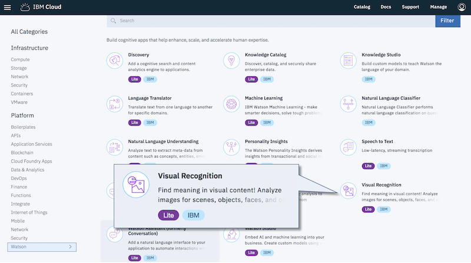
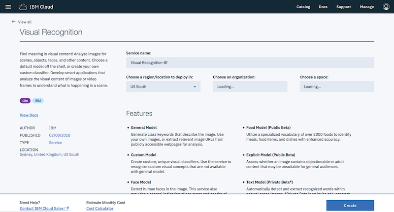
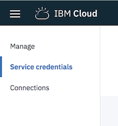

# Visual Recognition

In this lab, we'll create a custom classifier in IBM Watson Visual Recognition to recognize several dog breeds. We can then use this custom classifier to classify images and understand if there is certain breed of a dog in the image.

## Getting Started

This lab uses the IBM Watson Visual Recognition. Sign up for an IBM Cloud account at ibm.biz/. This lab also uses the command line to train the Visual Recognition service with images. You can also use a programming language to programmatically train the service. 

## Create a Custom Classifier

Let's begin by creating an instance of the IBM Watson Visual Recognition service.

1. Click on the **Catalog** link in the top right corner of the IBM Cloud dashboard.

    


2. Click on the **Watson** category on the left. Click on the **Visual Recognition** tile.

    

3. Leave the service name as is and click **Create**.

    

4. Click on **Service Credentials** in the menu on the left. If there are no credentials in the list, click **New credential** and **Add** to create a set of credentials. Click on **View Credentials** to display the service credentials.

    	    
    	        

5. Copy the API Key. Run the command, replacing the API key with your own.

     

    ```
    export VR_KEY="g0h123kjf5h3m620n5h1175mrk54h32vc54ji543"
    ```

6. Run the command shown below to get a list of the classifiers.

    ```
    curl "https://gateway-a.watsonplatform.net/visual-recognition/api/v3/classifiers?api_key=$VR_KEY&version=2016-05-20"
    ```

    A sample response is shown below. No custom classifiers have been trained.

    ```
    {
        "classifiers": []
    }
    ```

7. Download the sample ZIP files. Each ZIP file contains a set of images with different breeds of dogs, and one has a set of images without any dogs. These images provide a basic training for IBM Watson to use to understand the differences between the classes we'll create in a moment.

    * https://watson-developer-cloud.github.io/doc-tutorial-downloads/visual-recognition/beagle.zip
    * https://watson-developer-cloud.github.io/doc-tutorial-downloads/visual-recognition/golden-retriever.zip
    * https://watson-developer-cloud.github.io/doc-tutorial-downloads/visual-recognition/husky.zip
    * https://watson-developer-cloud.github.io/doc-tutorial-downloads/visual-recognition/cats.zip

8. Create a custom classifier using these ZIP files.

    ```
    curl -X POST -F "beagle_positive_examples=@beagle.zip" -F "goldenretriever_positive_examples=@golden-retriever.zip" -F "husky_positive_examples=@husky.zip" -F "negative_examples=@cats.zip" -F "name=dogs" "https://gateway-a.watsonplatform.net/visual-recognition/api/v3/classifiers?api_key=$VR_KEY&version=2016-05-20"
    ```

9. Copy the classifier ID that is returned. In the example response below, the classifer ID is `dogs_1992940714`. Your classifier ID will be different.

    ```
    {
        "classifier_id": "dogs_1992940714",
        "name": "dogs",
        "status": "training",
        "owner": "b9baae18-2dd5-4517-ad68-7c9a651f3dab",
        "created": "2018-03-28T06:13:18.523Z",
        "updated": "2018-03-28T06:13:18.523Z",
        "classes": [
            {
                "class": "husky"
            },
            {
                "class": "goldenretriever"
            },
            {
                "class": "beagle"
            }
        ],
        "core_ml_enabled": true
    }
    ```

10. Run the command to save this classifier ID in a variable.

    ```
    export CLASSIFIER_ID="dogs_1992940714"
    ```

11. Check the status of the classifier by running the command shown below. It may take several minutes (or longer) for the training to complete.

    ```
    curl "https://gateway-a.watsonplatform.net/visual-recognition/api/v3/classifiers?api_key=$VR_KEY&version=2016-05-20"
    ```

    An example response is shown below.
    
    ```
    {
        "classifiers": [
            {
                "classifier_id": "dogs_1992940714",
                "name": "dogs",
                "status": "training"
            }
        ]
    }
    ```

    When the classifier has been completely trained, the status will become `ready`.
    
    ```
    {
        "classifiers": [
            {
                "classifier_id": "dogs_1992940714",
                "name": "dogs",
                "status": "ready"
            }
        ]
    }
    ```

12. When the status changes to `ready`, you can now classify images with this custom classifier.

    ```
    curl "https://gateway-a.watsonplatform.net/visual-recognition/api/v3/classify?api_key=$VR_KEY&url=http://cdn2-www.dogtime.com/assets/uploads/gallery/beagle-dog-breed-pictures/1-runforward.jpg&version=2016-05-20&classifier_ids=$CLASSIFIER_ID&threshold=0.0"
    ```

    An example response is shown below.

    ```
    {
        "images": [
            {
                "classifiers": [
                    {
                        "classifier_id": "dogs_1992940714",
                        "name": "dogs",
                        "classes": [
                            {
                                "class": "beagle",
                                "score": 0.888
                            },
                            {
                                "class": "goldenretriever",
                                "score": 0.02
                            },
                            {
                                "class": "husky",
                                "score": 0
                            }
                        ]
                    }
                ],
                "source_url": "http://cdn2-www.dogtime.com/assets/uploads/gallery/beagle-dog-breed-pictures/1-runforward.jpg",
                "resolved_url": "http://cdn2-www.dogtime.com/assets/uploads/gallery/beagle-dog-breed-pictures/1-runforward.jpg"
            }
        ],
        "images_processed": 1,
        "custom_classes": 3
    }
    ``` 

    Watson recognizes the class `beagle`. 
    
13. Find another image on the internet and classify it by replacing the URL value in the previous step to point to the location of the image.